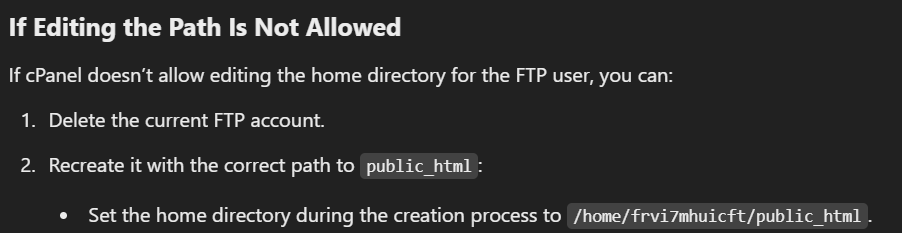

# Misc Notes

**Establish FTP Connection to "Public_HTML Directory **

1) Go to cPanel > Click FTP Accounts
2) Create a new FTP account with a username and password
3) Make sure Directory has the following path: "/home/frvi7mhuicft/public_html"
4) Adjust FTP JSON configuration file 

